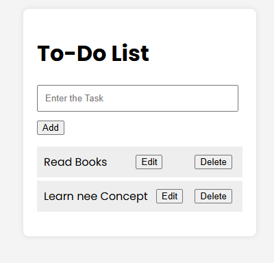

 # 📝 Node.js ToDo App
A simple, full-stack To-Do List application built with pure Node.js—no frameworks like Express, and no front-end libraries. All logic is handled using core Node.js modules, vanilla JavaScript, HTML, and CSS.
---
### 📁 Project Structure
```bash 
ToDo App/
├── public/
│   ├── index.html
│   ├── style.css
│   └── script.js
├── todos.json      # JSON file used to store tasks
└── server.js       # Main Node.js server file

```
---
### 🚀 Features
- Add, update, and delete tasks
- Data persistence via local todos.json file
- RESTful API using only core http module
- Static file serving (HTML, CSS, JS)
- Lightweight and dependency-free
---
### Screenshots

---
### 🛠️ Requirements
- Node.js (v14 or later)
---
### 📌 Notes
- All tasks are saved in a todos.json file on the server.
- No external libraries or frameworks are used.
- Great for understanding how web apps work behind the scenes.
---
## 👨‍💻 Author

**Ganesan**
[](https://www.linkedin.com/in/gane-an)

---
### <center> Thank You for visiting 😊</center>