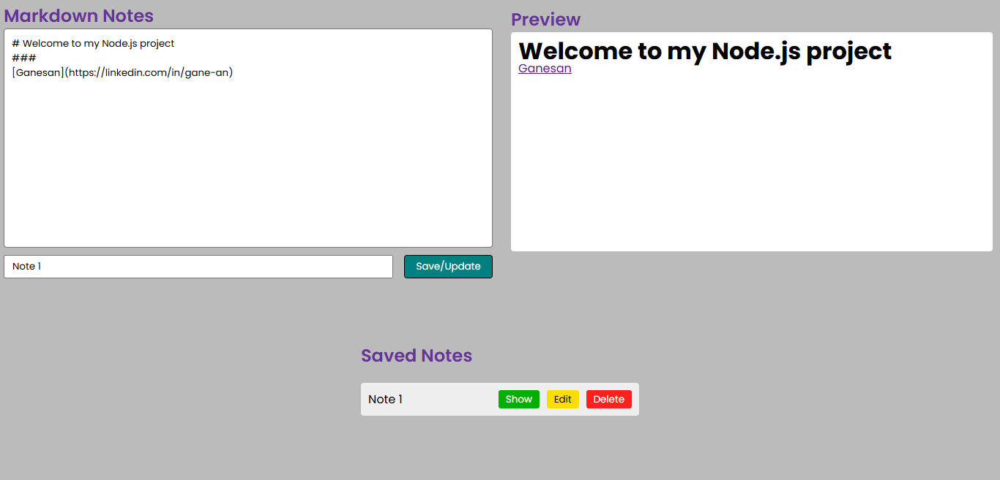

# 📝 Markdown Notes Preview App (Node.js + MySQL)

A lightweight **Markdown note-taking app** with real-time preview, built using **core Node.js** and **MySQL** for persistent storage.

---

## 🚀 Features

- ✍️ **Write & preview** Markdown notes in real time
- 💾 **Save, update, delete, and view** notes with MySQL database
- 📂 Notes stored in **MySQL table** (`notes`) instead of JSON file
- 📥 **Download notes** as `.md` files
- ⚡ **Pure Node.js backend** (`http`, `fs`, `path`) – no frameworks like Express

---

## 📂 Project Structure

```bash
Markdown-Preview/
├── public/
│   ├── index.html      # UI (Markdown editor & preview)
│   ├── style.css       # Styling
│   └── script.js       # Frontend logic
├── config/
│   └── db.js           # MySQL connection configuration
└── server.js           # Core Node.js backend
```

---

## 🖼️ Screenshots



---

## 🗄️ Database Setup

Run the following SQL commands in MySQL before starting:

```sql
CREATE DATABASE notes_app;

USE notes_app;

CREATE TABLE notes (
  id BIGINT PRIMARY KEY AUTO_INCREMENT,
  name VARCHAR(255) NOT NULL,
  content TEXT NOT NULL
);
```

Update your MySQL credentials in **`config/db.js`**:

```js
import mysql from "mysql2/promise";

const db = await mysql.createConnection({
  host: "localhost",
  user: "root", // your MySQL username
  password: "root", // your MySQL password
  database: "notes_app",
});

export default db;
```

---

## 📌 Usage Guide

1. Start the server:

   ```bash
   node server.js
   ```

   Server runs at: [http://localhost:9090](http://localhost:9090)

2. Open the app in your browser.

3. Type Markdown in the **editor (left panel)**.

4. Instantly see the **live preview (right panel)**.

5. Use buttons to **Save / Update / Show / Edit / Delete** notes.

---

## 🌐 API Endpoints

| Method     | Endpoint     | Description             | Example Request Body                                 |
| ---------- | ------------ | ----------------------- | ---------------------------------------------------- |
| **GET**    | `/api/notes` | Fetch all notes         | –                                                    |
| **POST**   | `/api/notes` | Add a new note          | `{ "name": "Note1", "content": "## Markdown" }`      |
| **PUT**    | `/api/notes` | Update an existing note | `{ "id": 123, "name": "Updated", "content": "..." }` |
| **DELETE** | `/api/notes` | Delete a note           | `{ "id": 123 }`                                      |

---

## 🛠️ Tech Stack

- **Frontend** → HTML, CSS, JavaScript, [Marked.js](https://marked.js.org/)
- **Backend** → Core Node.js (`http`, `fs`, `path`)
- **Database** → MySQL (`mysql2`)

---

## 👨‍💻 Author

**Ganesan**
[](https://www.linkedin.com/in/gane-an)

---

<p align="center">🙏 Thanks for visiting! If you like this project, fork the repo and work on it 🚀</p>
