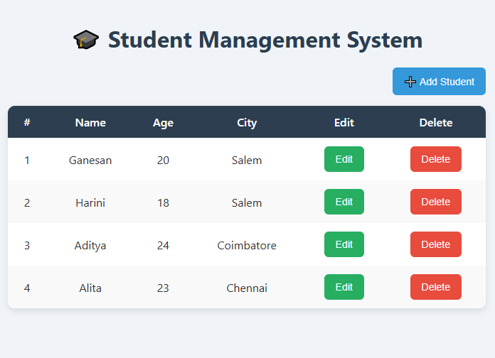
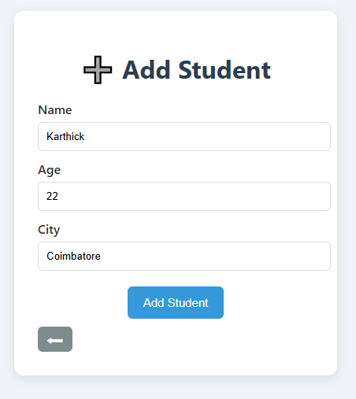
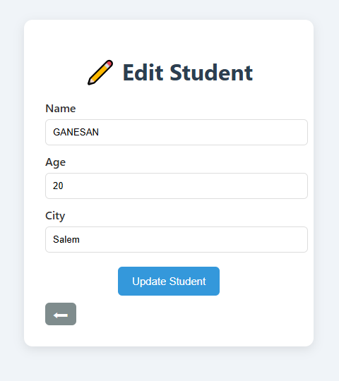

# 🎓 Student Management System (CRUD App)

A simple **Student Management System** built with **Node.js (Express) + MySQL (backend)** and **HTML/JS (frontend)**.  
This project demonstrates **CRUD operations**: Create, Read, Update, and Delete students.

## 📌 Features

- View all students (with serial no., name, age, city).
- Add new student.
- Edit existing student.
- Delete student.

## 📂 Project Structure

```
student-management/
│── backend/
│   ├── server.js
│   ├── config/
│   │   └── db.js
│   ├── routes/
│   │   └── studentRoutes.js
│   ├── controllers/
│   │   └── studentController.js
│   └── models/
│       └── studentModel.js
│
│── frontend/
│   ├── index.html        # View all students
│   ├── add.html          # Add new student
│   ├── edit.html         # Edit student
│   └── js/
│       └── app.js        # Frontend logic

```

## 🛠️ Tech Stack

- **Backend:** Node.js, Express.js
- **Database:** MySQL (mysql2)
- **Frontend:** HTML, CSS, JavaScript
- **API Communication:** REST (Fetch API)

---

## 🚀 Setup Instructions

### 1️⃣ Clone the repo

```bash
git clone https://github.com/your-username/student-management.git
cd student-management
```

### 2️⃣ Setup Database

Open MySQL and run:

```sql
CREATE DATABASE student_db;

USE student_db;

CREATE TABLE students (
  id INT AUTO_INCREMENT PRIMARY KEY,
  name VARCHAR(100) NOT NULL,
  age INT NOT NULL,
  city VARCHAR(100) NOT NULL
);
```

### 3️⃣ Install backend dependencies

```bash
cd backend
npm init -y
npm install express mysql2 cors
```

### 4️⃣ Run Backend Server

```bash
node server.js
```

✅ Server will start at:

```
http://localhost:3000
```

### 5️⃣ Open Frontend

Simply open `frontend/index.html` in your browser.
(It will fetch data from the backend API.)

---

## 📡 API Endpoints

| Method | Endpoint            | Description          |
| ------ | ------------------- | -------------------- |
| GET    | `/api/students`     | Get all students     |
| POST   | `/api/students`     | Add new student      |
| PUT    | `/api/students/:id` | Update student by ID |
| DELETE | `/api/students/:id` | Delete student by ID |

---

## 🎯 How it Works

1. **index.html** → Displays all students in a table with Edit/Delete buttons.
2. **add.html** → Simple form to add a new student.
3. **edit.html** → Pre-filled form to edit selected student.
4. **app.js** → Contains all frontend logic (fetch API calls).

---

## 📷 Screenshots (Sample)

- **Student List Page**

  

- **Add Student Page**

  

- **Edit Student Page**

  

---

## 👨‍💻 Author

Developed by **Ganesan** 🚀
