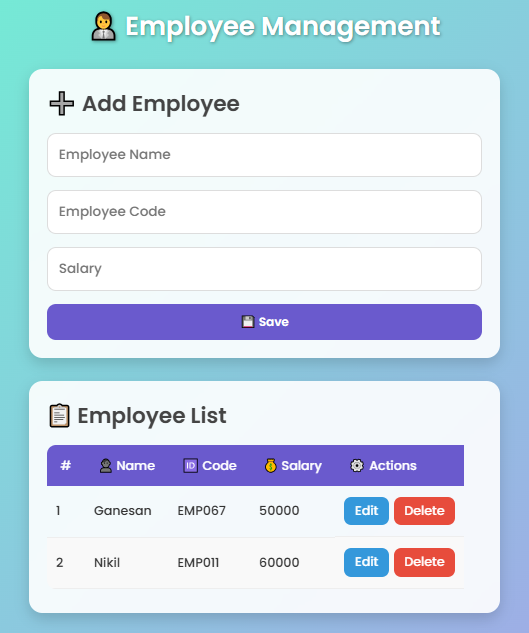

# 👨‍💼 Employee Management System

A full-stack **Employee Management Application** built with:

- **Backend:** Node.js, Express.js, MySQL
- **Frontend:** HTML, CSS, Vanilla JavaScript
- **Database:** MySQL

This project demonstrates CRUD (Create, Read, Update, Delete) operations with a clean UI and REST APIs.

---

## 📂 Project Structure

```
Employee management/
├─ Backend/
│  ├─ config
│  │  └─ db.js
│  ├─ controllers
│  │  └─ employee.controller.js
│  ├─ error
│  │  └─ employee.errorhandler.js
│  ├─ server.js
│  └─ services
│     └─ employee.service.js
├─ Frontend/
│  ├─ index.html
│  ├─ script.js
│  └─ style.css
├─ package-lock.json
├─ package.json
└─ README.md
```

---

## 🚀 Features

- ✅ Add new employee
- ✅ View all employees in a table
- ✅ Edit existing employee
- ✅ Delete employee with confirmation
- ✅ Beautiful & responsive UI

---

## 🛠️ Backend Setup

### 1️⃣ Clone the repo

1. Go to: [5-emp-mgn-sys](https://github.com/gane-an/node-js-projects/tree/main/5-emp-mgn-sys)
2. Click the green **Code** button → **Download ZIP**.
3. Extract the ZIP file.
4. Open the folder `4-student-mgnt-sys` in your editor (e.g., VS Code).
5. Follow the setup instructions in this README to run the project.

### 2️⃣ Install dependencies:

```bash
npm install
```

### 3️⃣ Create MySQL database and table:

```sql
CREATE DATABASE employee_db;

USE employee_db;

CREATE TABLE employees (
  id INT AUTO_INCREMENT PRIMARY KEY,
  name VARCHAR(100) NOT NULL,
  employee_code VARCHAR(50) NOT NULL,
  salary DECIMAL(10,2) NOT NULL
);
```

### 4️⃣ Update your DB credentials in `Backend/config/db.js`:

```js
const db = mysql.createPool({
  host: "localhost",
  user: "root",
  password: "your_password",
  database: "employee_db",
});
```

### 5️⃣ Start the backend:

```bash
node server.js
```

Server will run at: `http://localhost:3000`

---

## 🖥️ Frontend Setup

1. Navigate into `Frontend` folder.
2. Open `index.html` directly in your browser (double-click).
3. The UI will load and communicate with backend APIs at `http://localhost:3000/api/employees`.

---

## 📡 API Endpoints

Base URL: `http://localhost:3000/api/employees`

| Method | Endpoint | Description           |
| ------ | -------- | --------------------- |
| GET    | `/`      | Get all employees     |
| GET    | `/:id`   | Get employee by ID    |
| POST   | `/`      | Add new employee      |
| PUT    | `/:id`   | Update employee       |
| DELETE | `/:id`   | Delete employee by ID |

---

## 🎨 Screenshots

### User Interface



---

## 🤝 Contributing

1. Fork the repo
2. Create a new branch (`feature-xyz`)
3. Commit changes
4. Push and create a Pull Request

---

## 📜 License

This project is licensed under the MIT License.

## 🙌 Thanks for Visiting!

If you found this project helpful, don’t forget to ⭐ star the repo and 🍴 fork it to make it your own.  
Contributions are always welcome 🚀
